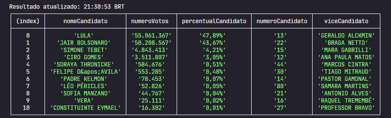

# Real Time Election 
Atualizado a cada 1 minuto.

### Como rodar?
1. Tenha o node na versão 16 instalado em sua máquina <a href="https://nodejs.org/en/download/" target="_blank">Clique aqui para baixar</a>

2. Instale as dependências com o comando `npm i`

3. Execute a aplicação com o comando `npm start`

### Resultado
